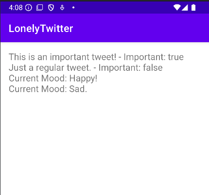

# LonelyTwitter

**Author:** Dricmoy Bhattacharjee  
**Date:** 05.09.2024

## Description

This project demonstrates the implementation of object-oriented programming (OOP) concepts, including encapsulation, inheritance, and abstract classes, in a Java application. The application features a basic structure for handling tweets and moods.



## Project Structure

### Classes

#### `Tweet`

An abstract class representing a tweet with attributes for date and message. It includes methods for accessing and modifying these attributes and an abstract method `isImportant()` that subclasses must implement.

#### `SadMood`

A concrete class extending `Mood` to represent a sad mood. Implements the `getMood()` method to return "Sad." and overrides the `toString()` method to provide a string representation of the mood including the date.

#### `HappyMood`

A concrete class extending `Mood` to represent a happy mood. Implements the `getMood()` method to return "Happy!" and overrides the `toString()` method to provide a string representation of the mood including the date.

## Implementation Details

### `Mood` Class

An abstract base class representing a mood with a date. Provides constructors for setting the date to the current date or a specific date, and an abstract method `getMood()` that subclasses must implement.

### `Tweet` Class

An abstract class implementing the `Tweetable` interface. Includes private attributes for date and message, constructors for initializing these attributes, and an abstract method `isImportant()` to be defined by subclasses.

### `SadMood` Class

Extends `Mood` and provides specific behavior for representing sadness.

### `HappyMood` Class

Extends `Mood` and provides specific behavior for representing happiness.

## Image Sizing

If you need to ensure that the image is not too large, use HTML within Markdown:

```html

